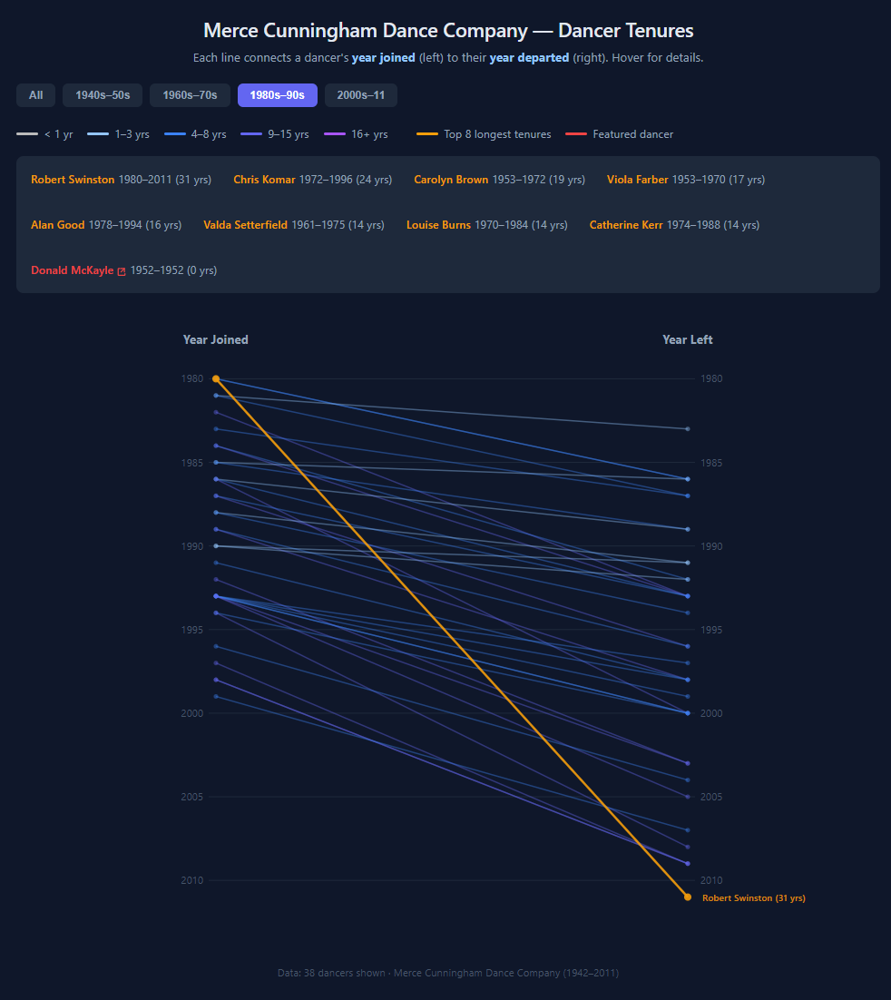

# Cunningham Dancer Spans

## Overview

Cunningham Dancer Spans is a learning visualization that uses a React, D3, and TypeScript slope chart to compare the first and last recorded years for 162 embedded dancer records associated with Merce Cunningham.

It is a secondary artifact in Jeremiah King's broader Cunningham visualization experiments. It preserves a particular visualization form and learning stage rather than presenting a comprehensive historical analysis.

## Live demo

[Open Cunningham Dancer Spans](https://unguisdraconis.github.io/cunningham-slope/)



## What the chart shows

- The left endpoint is a dancer's first recorded year.
- The right endpoint is the dancer's last recorded year.
- Line slope represents the elapsed recorded-year span: last year minus first year.
- Color bins group spans into broad ranges.
- Era buttons filter records by first recorded year.
- Eight records with the longest calculated spans are highlighted. Because the fixed eight-record cutoff can divide a tie, it should not be read as including every dancer tied at the boundary.
- Donald McKayle is separately featured as an example of why a recorded span is not a measure of artistic significance.

## Why “tenure” is qualified

The visualization simplifies each dancer to one first-to-last recorded span. Interrupted periods are collapsed into a single span, and same-year records have a calculated span of zero. The chart therefore should not be read as a complete record of uninterrupted company tenure.

## Data provenance

The embedded dancer data is derived from Cunningham dancer records associated with:

> Clarisse Bardiot. _Merce Cunningham_. Version 1. Zenodo. [doi:10.5281/zenodo.3774548](https://doi.org/10.5281/zenodo.3774548).

The original [`donnees-danseurs.csv`](cunningham-data/donnees-danseurs.csv) source file is now preserved in the repository alongside the companion [`donnees-cunningham.csv`](cunningham-data/donnees-cunningham.csv) works file. Both are byte-identical to the Version 1 Zenodo artifacts. The source dataset is licensed under [Creative Commons Attribution 4.0 International (CC BY 4.0)](https://creativecommons.org/licenses/by/4.0/).

The dancer file is 3,975 bytes with MD5 `6df22832d9cf076bd9956170dcc1e7e0` and SHA-256 `48c16d7c453a00927c2a54bb6859364ca012aacf74d9e9b295e1d87e7ffe4f52`. Its filesystem last-write time, `2026-02-22T07:45:34.8777546-05:00`, is documented as the **original download timestamp preserved by the repository maintainer**, not as the dataset publication or Git commit date. Full verification details for both files are in the [source-data note](cunningham-data/README.md).

The application still uses the separate embedded `rawData` array rather than parsing these files at runtime. Comparison with the restored dancer source accounts for all 162 rows in the same order: every year matches, 161 names match exactly, and one name was shortened. No executable version of the historical copy-and-mapping process was retained.

## Data transformation

The preserved dancer source is itself a flat table with one `Nom`, `in`, and `out` value per row. The embedded model maps those fields to `name`, `inYear`, and `outYear`, then calculates elapsed span as:

```text
last recorded year - first recorded year
```

The source-to-embedded comparison is documented in [`cunningham-data/README.md`](cunningham-data/README.md). Important limitations are preserved:

- any interrupted histories have already been collapsed into one first-to-last span in the source dancer table;
- the source schema contains no RUG/company or other category field, so those distinctions cannot be reconstructed from it;
- early-years records predating the formal 1953 formation of the Merce Cunningham Dance Company remain present;
- one source name was shortened in the embedded array;
- possible source-level transcription issues remain unresolved.

## TypeScript

This project reflects emerging TypeScript use through a typed dancer interface, typed component props and state, typed era tuples, and D3 calculations within typed React code. It is best understood as TypeScript exposure within a learning visualization rather than a claim of advanced TypeScript expertise.

## AI assistance

Claude Opus 4.6 was used as an AI-assisted coding tool during the project. Jeremiah King directed and reviewed the visualization and made the final project decisions.

## Accessibility and limitations

- The SVG has a semantic title and description.
- A live text summary reports the active era filter, displayed dancer count, and recorded-span definition.
- Native era buttons expose their active state and have visible keyboard focus.
- Exact details for most individual lines remain pointer-oriented.
- The visualization retains its historical fixed desktop-size SVG.
- No formal WCAG conformance claim is made.

## Local use

```text
npm ci
npm run dev
npm run lint
npm run build
```

## Licensing

**Dataset:** CC BY 4.0 under the cited Zenodo record.

**Application code:** No separate repository software license is currently specified.
